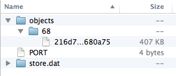

# Storing blobs

## What are blobs

The word blob is short for "binary large object". In addition to it's tabular data APIs, dat has separate APIs for working with blobs. 

The [data importing guide](https://github.com/maxogden/dat/blob/master/docs/importing.md) has more detailed information about the differences between the two types of storage, but for now just think of the blob store as a way to store files, like what you might put in Dropbox or attach to an email. The tabular store is for any data made up of rows and columns. The key difference between the two stores is that every row of data in the tabular store gets versioned, but blobs are more coarsely versioned, meaning dat simply stores multiple versions of the blobs.

You could import a CSV file as rows into the tabular store, or upload the entire thing as a blob. It all depends on your specific use case.

## Write a blob

We have conveniently provided a cat photo for you to use in this tutorial. It is called `cat.png` and should be in the `get-dat` directory.

Running `ls` should list `cat.png`. If you don't see `cat.png` then make sure you have navigated into the `get-dat` directory in your terminal.

Dat will store the actual contents of blobs in it's blob store, but it will track metadata about the blob (e.g. filename, size, etc) by storing the metadata in a row in the tabular store.

For this reason, to write a blob into dat you have to 'attach' it to a row. If the row you specify doesn't exist it will be created. Updating rows follows the same semantics as doing a `put`, e.g. you must supply the latest version for the update to work.

Attach the `cat.png` onto a row called `cat-pictures`:

```
dat blobs put cat-pictures cat.png
```

Since there was no existing row called `cat-pictures`, it was created for you.

Now start up the dat server with `dat listen` and then open `http://localhost:6461/` in your web browser to open the dat editor app.

If you inspect the row called `cat-pictures` in the dat editor app you should see something like this:

```JSON
{
  "key": "cat-pictures",
  "version": 1,
  "blobs": {
    "cat.png": {
      "key": "68216d70cb494e4fb51c0351942efdcdfc6c2c693d2787bbbece7c907e680a75",
      "size": 407474
    }
  }
}
```

This data is the metadata mentioned above. It is stored in the tabular data store. The blob metadata for each blob is stored under the `blobs` key.

To read the blob data, open `http://localhost:6461/api/rows/cat-pictures/cat.png` in your browser and it should show the cat picture.

Dat uses the `key` property of the blob metadata to retrieve the contents of the blob when they are accessed. When using the default blob store dat will store data in the `.dat/objects` folder. The key is the [SHA-256](http://en.wikipedia.org/wiki/SHA-2) hash of the contents of the blob. If you open up the `.dat` folder you can see the file.


